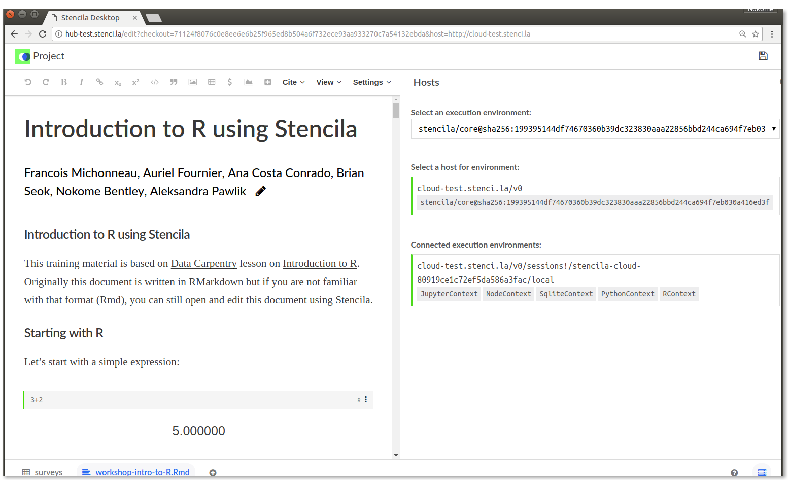

# ☁️ Cloud

## ⚠️ Deprecated

This project is deprecated. Please see ✨ [`stencila/sparkla`](https://github.com/stencila/sparkla) which provides compute sessions that are faster to start, more secure, and have finer grained control, and real-time user notifications, for resource usage. 

## 💭 Purpose

In Stencila, execution `Contexts` are provided by a `Host` (if you are familiar with Jupyter, then Stencila `Contexts` are like Jupyter kernels and a `Host` is like a kernel gateway). In addition to providing `Contexts`, `Hosts` can also provide execution `Environments` (which have one or more `Contexts` with in them e.g. `PythonContext`, `RContext`) plus language specific packages (e.g. `pandas`, `ggplot2`). There is a `Host` HTTP API (currently in draft) available [here](https://stencila.github.io/specs/host.html).

This package, `stencila/cloud`, implements the Stencila `Host` API for running alternative execution `Environments` as Docker containers within a Kubernetes cluster. It is intended as a way of providing users of Stencila with an easy way to render Stencila documents withing alternative execution environments, without having to install packages themselves, or install and run Docker.


_An example of a document using a `RContext`, hosted within the `stencila/core` execution environment, provided by `stencila/cloud`._

## 📦 Install and deploy

See the [`Dockerfile`](Dockerfile) for building a container and [`deploy.yaml`](deploy.yaml) and [`minikube.yaml`](minikube.yaml) for example Kubernetes deployments.

## 🛠️ Develop

Quickstart:

```sh
git clone https://github.com/stencila/cloud.git
cd cloud
npm install
```

Most development tasks can be run directly from `npm` or via `make` recipes.


Task                       | `npm`                                | `make`          |
---------------------------|--------------------------------------|-----------------|
Install dependencies       | `npm install`                        | `make setup`
Check for lint             | `npm run lint`                       | `make lint`
Run with Minikube          | `NODE_ENV='development' npm start`   | `make run-with-minikube`
Run inside Minikube        |                                      | `make run-inside-minikube`

## 🏃 Run with Minikube

You can run the sever locally but get it to create new session pods within an Minikube cluster. 

Install [`minikube`](https://kubernetes.io/docs/tasks/tools/install-minikube/) and [`kubectl`](https://kubernetes.io/docs/tasks/tools/install-kubectl/). Then start the Minikube cluster,

```bash
minikube start
make run-with-minikube
```

The server will be available on http://localhost:2000 but will create new pods on Minikube. e.g. Create a new session using [HTTPie](https://httpie.org/)

```bash
http PUT :2000/execute environment:='{"id":"alpine"}'
```

Use `minikube dashboard` or `kubectl get pods` to confirm that the session pods are getting created.

## 🏃 Run inside Minikube

You can run the server inside Minikube and create new session pods there too. 

Deploy `stencila/cloud` to the Minikube cluster,

```bash
minikube start
make run-inside-minikube
```

Check the `Deployment` is ready (the dashboard can be useful for this too: `minikube dashboard`),

```bash
kubectl get deployments

NAME                        DESIRED   CURRENT   UP-TO-DATE   AVAILABLE   AGE
stencila-cloud-deployment   1         1         1            0           1d
```

You can then get the URL of the host:

```bash
minikube service stencila-cloud-server --url
```

And check that it responds:

```bash
curl $(minikube service stencila-cloud-server --url)
```

If you're developing the Docker images in the [`stencila/images`](http://github.com/stencila/images) repo you can save time (and bandwidth) by not pushing/pulling images to/from the Docker Hub registry and the Minikube cluster. To do that, configure your local Docker client to use the Docker engine running inside the Minikube cluster:

```bash
eval $(minikube docker-env)
```
